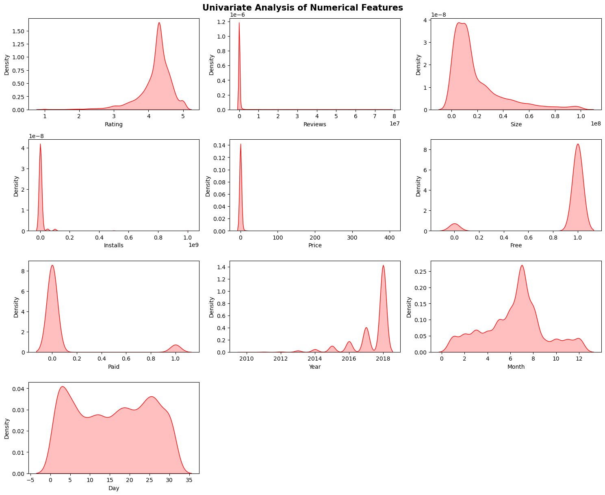
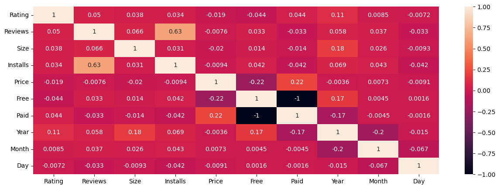
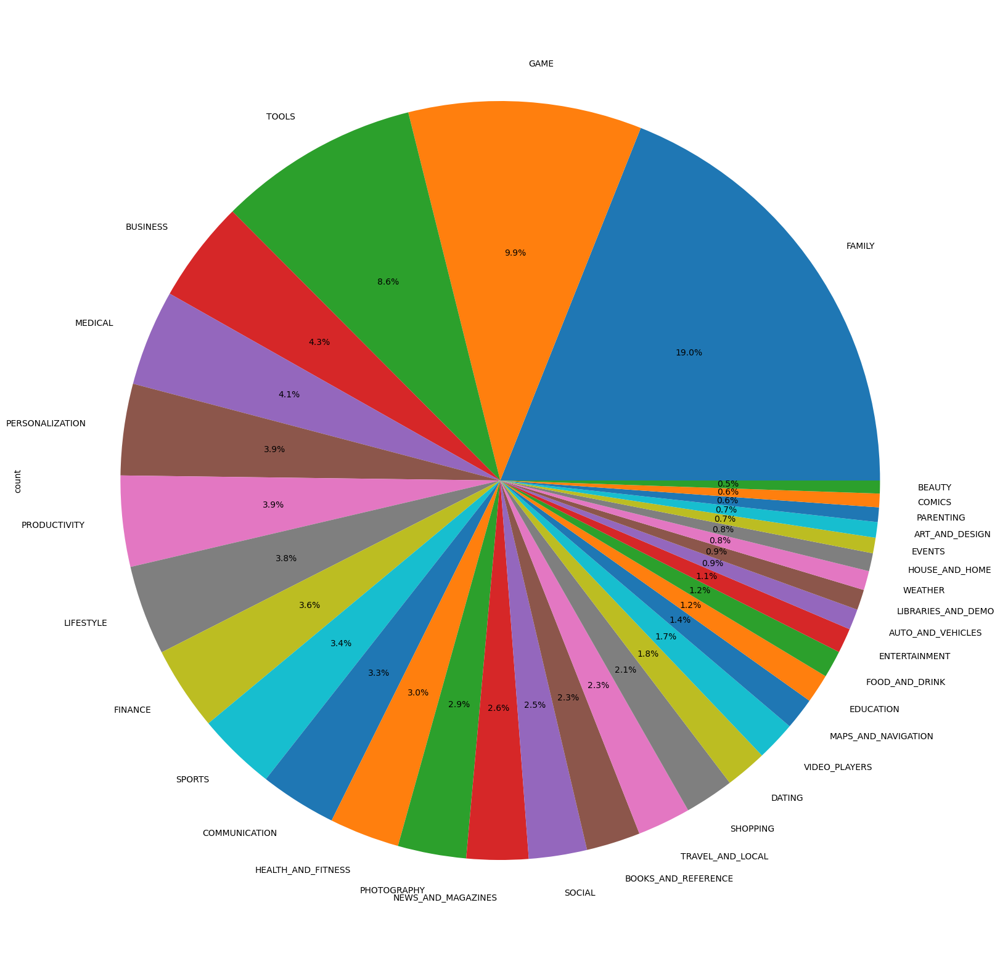
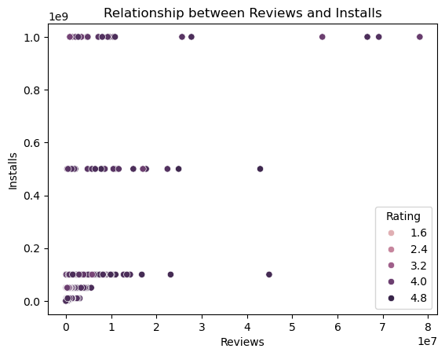
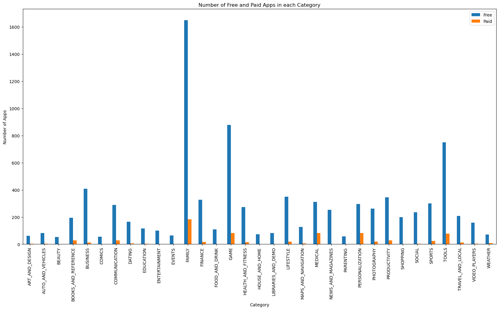

# 📱 Google Play Store App Analysis - EDA Project

## 🧾 Overview

This project performs Exploratory Data Analysis (EDA) on a dataset of apps from the Google Play Store, aiming to extract insights into app trends, popularity, pricing, user engagement, and category distribution.

We clean and preprocess the raw dataset, handle missing and inconsistent entries, and visualize relationships between features such as Installs, Ratings, Size, Type, Price, and Category to uncover what drives app success.

## 🧪 Dataset Description

📂 Raw Dataset

Source: GitHub - [Krishnaik06/playstore-Dataset](https://raw.githubusercontent.com/krishnaik06/playstore-Dataset/main/googleplaystore.csv)

File: google_playstore_raw.csv

Contains metadata for over 10,000 apps listed on Google Play Store.

Features include:

App, Category, Rating, Reviews, Size, Installs, Type, Price, Content Rating, Genres, Last Updated, etc.

## 🧹 Cleaned Dataset

File: google_playstore_cleaned.csv

1. Cleaned entries for better consistency and analysis:
2. Converted installs, prices, and sizes to numerical format
3. Removed duplicates and entries with missing/invalid values
4. Encoding Type feature and extracted datetime features from Last Updated feature.

## 🎯 Problem Statement

To explore the Google Play Store dataset to identify key trends and patterns in app distribution, pricing, popularity, and user engagement, and understand what factors influence app success.

## 🧠 Key EDA Questions Answered

1. Which app category is most common on the Play Store?
2. Which apps have the highest number of installs and reviews in each category?
3. Do paid apps have higher ratings than free apps?
5. What are the most expensive apps?
4. What is the correlation between app size, price, rating, installs and reviews?
5. Which content ratings are most common?
6. Univariate, Bivariate and Multivariate Analysis of features

## 📊 Sample Visualizations Included

## 🧰 Tools Used
1. Python (Pandas, NumPy, Matplotlib, Seaborn, Plotly)
2. Jupyter Notebook

## 🤝 Acknowledgments

1. Dataset by Krishnaik06
2. Google Play Store

